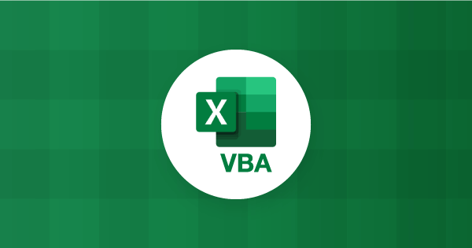

# VBA Applications
 

Welcome to the **VBA Applications** repository! This collection features a range of applications and scripts developed in Visual Basic for Applications (VBA), designed to enhance productivity across various Microsoft Office applications.

## Overview

This repository serves as a space to explore practical solutions for automating tasks and improving workflows in Excel, Access, and other Office applications. Each project reflects a commitment to coding best practices and problem-solving.

## Features

- **Task Automation:** Simplify repetitive tasks in Excel and Access.
- **Custom User Forms:** Create user-friendly interfaces for data entry and reporting.
- **Database Interaction:** Manage and manipulate data efficiently in Access.
- **Reporting Tools:** Generate automated reports to support decision-making.
